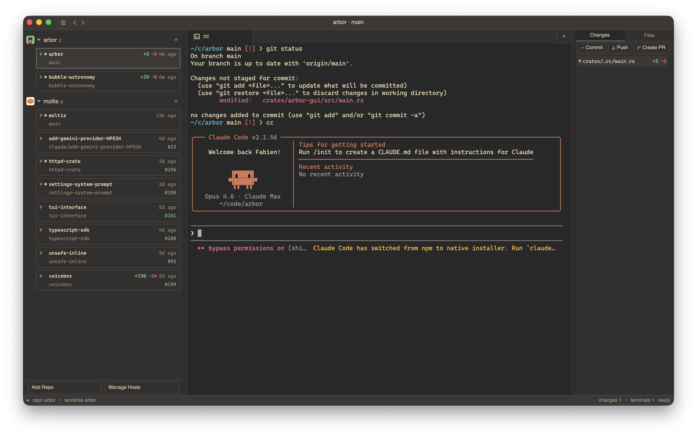

<p align="center">
  <a href="assets/screenshot.png">
    
  </a>
</p>

# Arbor

[](https://github.com/penso/arbor/actions/workflows/ci.yml)
[](https://rust-lang.org)
[](LICENSE)
[](https://github.com/penso/arbor/releases)
[](#install)
[](#install)

Arbor is a **fully native app for agentic coding** built with Rust and [GPUI](https://gpui.rs).
It gives you one place to manage repositories, parallel worktrees, embedded terminals, diffs, and AI coding agent activity.

## Why Arbor

- Fully native desktop app (UI + terminal stack, Rust + GPUI), optimized for long-running local workflows
- One workspace for worktrees, terminals, file changes, and git actions
- Built for parallel coding sessions across local repos and remote outposts

## Core Capabilities

### Worktree Management
- List, create, and delete worktrees across multiple repositories
- Delete confirmation with unpushed commit detection
- Optional branch cleanup on worktree deletion
- Worktree navigation history (back/forward)
- Last git activity timestamp per worktree

### Embedded Terminal
- Built-in PTY terminal with truecolor and `xterm-256color` support
- Multiple terminal tabs per worktree
- Alternative backends: Alacritty, Ghostty
- Persistent daemon-based sessions (survive app restarts)
- Session attach/detach and signals (interrupt/terminate/kill)

### Diff and Changes
- Side-by-side diff display with addition/deletion line counts
- Changed file listing per worktree
- File tree browsing with directory expand/collapse
- Multi-tab diff sessions

### AI Agent Visibility
- Detects running coding agents: Claude Code, Codex, OpenCode
- Working/waiting state indicators with color-coded dots
- Real-time updates over WebSocket streaming

### Remote Outposts
- Create and manage remote worktrees over SSH
- Multi-host configuration with custom ports and identity files
- Mosh support for better connectivity
- Remote terminal sessions via `arbor-httpd`
- Outpost status tracking (available, unreachable, provisioning)

### GitHub + UI + Config
- Automatic PR detection and linking per worktree
- Git actions in the UI: commit, push
- Three-pane layout (repositories, terminal, changes/file tree)
- Resizable panes, collapsible sidebar, desktop notifications
- Twenty-five themes, including Omarchy defaults
- TOML config at `~/.config/arbor/config.toml` with hot reload

## Install

### Homebrew (macOS)

```bash
brew install penso/arbor/arbor
```

### Prebuilt Binaries

Download the latest build from [Releases](https://github.com/penso/arbor/releases).

### Quick Start from Source

```bash
git clone https://github.com/penso/arbor
cd arbor
just run
```

## Documentation

Full documentation is available at [penso.github.io/arbor/docs](https://penso.github.io/arbor/docs/).

## Crates

| Crate | Description |
|-------|-------------|
| `arbor-core` | Worktree primitives, change detection, agent hooks |
| `arbor-gui` | GPUI desktop app (`arbor` binary) |
| `arbor-httpd` | Remote HTTP daemon (`arbor-httpd` binary) |
| `arbor-web-ui` | TypeScript dashboard assets + helper crate |

## Building from Source

### Prerequisites

- **Rust nightly** — the project uses `nightly-2025-11-30` (install via [rustup](https://rustup.rs/))
- **[just](https://github.com/casey/just)** — task runner
- **[CaskaydiaMono Nerd Font](https://www.nerdfonts.com/)** — icons in the UI use Nerd Font glyphs

#### macOS

```
just setup-macos
```

Or manually:

```
xcode-select --install
xcodebuild -downloadComponent MetalToolchain
brew install --cask font-caskaydia-mono-nerd-font
```

#### Linux (Debian/Ubuntu)

```
just setup-linux
```

Or manually:

```
sudo apt-get install -y libxcb1-dev libxkbcommon-dev libxkbcommon-x11-dev
```

Then install the [CaskaydiaMono Nerd Font](https://www.nerdfonts.com/font-downloads) to `~/.local/share/fonts/`.

## Similar Tools

- [Superset](https://superset.sh) — terminal-based worktree manager
- [Jean](https://jean.build) — dev environment for AI agents with isolated worktrees and chat sessions
- [Conductor](https://www.conductor.build) — macOS app to orchestrate multiple AI coding agents in parallel worktrees

## Acknowledgements

Thanks to [Zed](https://zed.dev) for building and open-sourcing [GPUI](https://gpui.rs), the GPU-accelerated UI framework that powers Arbor.

## Star History

[](https://www.star-history.com/#penso/arbor&type=date&legend=top-left)
