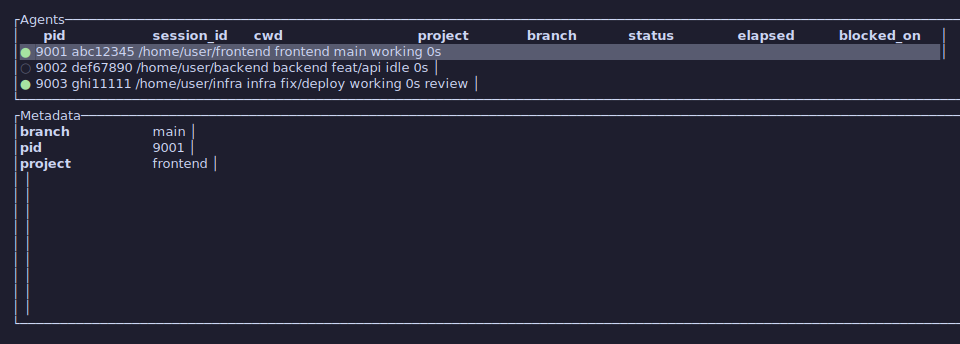
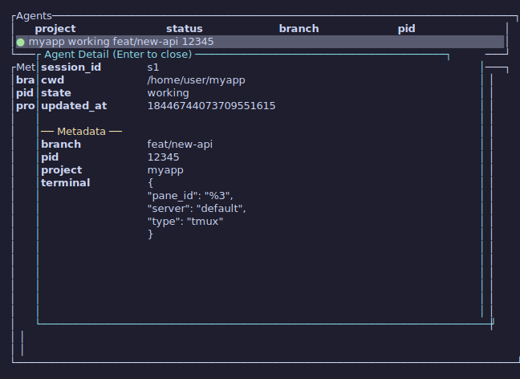
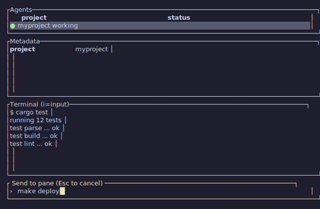
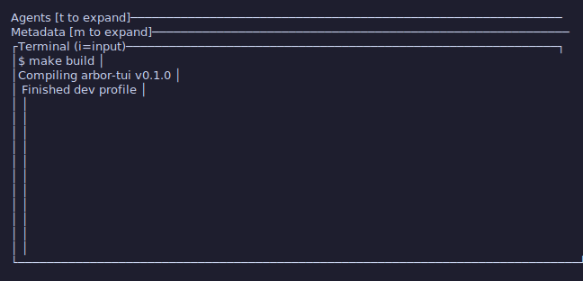
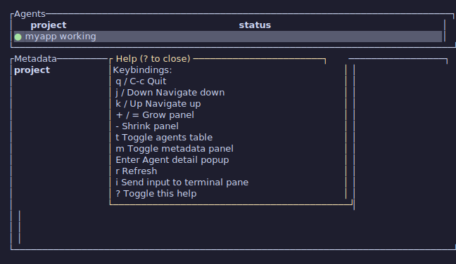

# arbor-tui

Terminal dashboard for monitoring the [Arbor](https://github.com/penso/arbor) daemon.
Displays agent activity with configurable columns, collapsible panels,
and optional live tmux output using [ratatui](https://ratatui.rs).

All screenshots below are generated by automated tests (`cargo test`)
with Catppuccin Mocha colors.

### Main view -- agents table with metadata columns



### Agent detail popup (Enter)



### Terminal pane with input bar (i)



### Collapsed panels (t/m toggles)



### Help overlay (?)



## Quick start

### 1. Start the Arbor daemon

```bash
cargo run -p arbor-httpd
```

### 2. Start arbor-tui

```bash
cargo run -p arbor-tui

# Or specify a custom port
cargo run -p arbor-tui -- --port 9000
```

### 3. Set up Claude Code hooks

For the daemon to detect agent activity, add hooks to your
Claude Code settings (`~/.claude/settings.json` or project
`.claude/settings.json`).

Claude Code hooks receive a JSON payload on **stdin** with
`session_id` and `cwd`. The hook script reads that, enriches
it with metadata from the environment, and POSTs to the daemon.

#### Example hook: basic (no metadata)

The simplest hook just forwards session info:

```bash
#!/usr/bin/env bash
set -euo pipefail

EVENT_NAME="${1:-}"
[ -z "$EVENT_NAME" ] && exit 0

PAYLOAD=$(cat)
SESSION_ID=$(echo "$PAYLOAD" | jq -r '.session_id // empty')
CWD=$(echo "$PAYLOAD" | jq -r '.cwd // empty')
[ -z "$SESSION_ID" ] && exit 0

curl -s -X POST "http://127.0.0.1:8787/api/v1/agent/notify" \
  -H 'Content-Type: application/json' \
  -d "{\"hook_event_name\":\"$EVENT_NAME\",\"session_id\":\"$SESSION_ID\",\"cwd\":\"$CWD\"}" \
  >/dev/null 2>&1 &
```

#### Example hook: with metadata

A richer hook that auto-detects project context from the
working directory. Metadata fields appear as columns in the
agents table and in the detail overlay (Enter key).

```bash
#!/usr/bin/env bash
# ~/.local/bin/arbor-agent-notify
set -euo pipefail

EVENT_NAME="${1:-}"
[ -z "$EVENT_NAME" ] && exit 0

PAYLOAD=$(cat)
SESSION_ID=$(echo "$PAYLOAD" | jq -r '.session_id // empty')
CWD=$(echo "$PAYLOAD" | jq -r '.cwd // empty')
[ -z "$SESSION_ID" ] && exit 0

# Start with PID of the Claude Code process
META_JSON=$(jq -nc --arg pid "$PPID" '{pid: $pid}')

# Auto-detect VCS context from CWD
if [ -n "$CWD" ]; then
  # jj: workspace name and project
  if JJ_ROOT=$(jj --ignore-working-copy --repository "$CWD" workspace root 2>/dev/null); then
    JJ_WS=$(jj --ignore-working-copy --repository "$CWD" workspace list 2>/dev/null \
            | head -1 | awk '{print $1}')
    META_JSON=$(echo "$META_JSON" | jq -c \
      --arg project "$(basename "$JJ_ROOT")" \
      '. + {project: $project}')
    [ -n "$JJ_WS" ] && META_JSON=$(echo "$META_JSON" | jq -c \
      --arg ws "$JJ_WS" '. + {workspace: $ws}')

  # git: branch and project
  elif GIT_ROOT=$(git -C "$CWD" rev-parse --show-toplevel 2>/dev/null); then
    GIT_BRANCH=$(git -C "$CWD" branch --show-current 2>/dev/null)
    META_JSON=$(echo "$META_JSON" | jq -c \
      --arg project "$(basename "$GIT_ROOT")" \
      '. + {project: $project}')
    [ -n "$GIT_BRANCH" ] && META_JSON=$(echo "$META_JSON" | jq -c \
      --arg branch "$GIT_BRANCH" '. + {branch: $branch}')
  fi
fi

# Tmux terminal info (enables live pane capture in arbor-tui)
if [ -n "${TMUX:-}" ] && [ -n "${TMUX_PANE:-}" ]; then
  TMUX_SERVER=$(echo "$TMUX" | cut -d, -f1 | xargs basename 2>/dev/null || echo "default")
  META_JSON=$(echo "$META_JSON" | jq -c \
    --arg s "$TMUX_SERVER" --arg p "$TMUX_PANE" \
    '. + {terminal: {type: "tmux", server: $s, pane_id: $p}}')
fi

curl -s -X POST "http://127.0.0.1:8787/api/v1/agent/notify" \
  -H 'Content-Type: application/json' \
  -d "{\"hook_event_name\":\"$EVENT_NAME\",\"session_id\":\"$SESSION_ID\",\"cwd\":\"$CWD\",\"metadata\":$META_JSON}" \
  >/dev/null 2>&1 &
```

This sends metadata like:

```json
{
  "pid": "12345",
  "project": "myapp",
  "branch": "feat/new-api",
  "terminal": { "type": "tmux", "server": "default", "pane_id": "%3" }
}
```

Any scalar metadata field (string, number, boolean) automatically
appears as a column in the agents table. Object fields like
`terminal` are hidden from the table but visible in the detail
overlay.

#### Register the hook

```json
{
  "hooks": {
    "UserPromptSubmit": [
      {
        "matcher": "",
        "hooks": [
          {
            "type": "command",
            "command": "~/.local/bin/arbor-agent-notify UserPromptSubmit"
          }
        ]
      }
    ],
    "Stop": [
      {
        "matcher": "",
        "hooks": [
          {
            "type": "command",
            "command": "~/.local/bin/arbor-agent-notify Stop"
          }
        ]
      }
    ]
  }
}
```

The daemon recognizes two hook events:
- **`UserPromptSubmit`** -- marks agent as "working"
- **`Stop`** -- marks agent as "waiting"

## Default keybindings

| Key | Action |
|-----|--------|
| `q` / `Ctrl-c` | Quit |
| `j` / `Down` | Navigate down |
| `k` / `Up` | Navigate up |
| `Enter` | Agent detail popup |
| `t` | Toggle agents table |
| `m` | Toggle metadata panel |
| `+` / `=` | Grow panel |
| `-` | Shrink panel |
| `r` | Refresh |
| `i` | Send input to terminal pane |
| `?` | Help overlay |

All keybindings are configurable. See [Configuration](#configuration).

## Configuration

arbor-tui loads a default config embedded in the binary, then merges
with `~/.arbor/tui.toml` if it exists. Copy the default config to
customize:

```bash
mkdir -p ~/.arbor
cp crates/arbor-tui/config/default.toml ~/.arbor/tui.toml
```

### Agent header (table columns)

The `agent_header` format string controls which columns appear
in the agents table. Fields use `${name:width}` syntax where
negative width is left-aligned and positive is right-aligned.

Built-in fields: `session_id`, `cwd`, `status`, `elapsed`.
Any metadata key sent by your hook is also available.

```toml
[tui]
# Show project and branch from metadata alongside built-in fields
agent_header = "${session_id:8} ${cwd:-24} ${project:-16} ${branch:-16} ${status:-8} ${elapsed:>6}"
```

Metadata fields not listed in the header are auto-discovered
and appended as columns. To hide auto-discovered fields:

```toml
[tui]
hidden_columns = ["pid", "message"]
```

### Field colors

Color metadata values conditionally or statically:

```toml
[tui.field_colors]
# Map: different color per value
status = { working = "green", idle = "yellow", blocked = "red" }

# Static: same color for all values
project = "cyan"
branch = "blue"
```

### Status icons

```toml
[tui.status_icons]
working = "●"
idle = "○"
other = "◌"
```

### Custom action hooks

Action hooks are custom keybindings that run shell commands on the
selected agent. They receive `ARBOR_*` environment variables:

```toml
[actions.open_finder]
key = "o"
command = "open $ARBOR_CWD"

[actions.open_terminal]
key = "g"
command = "open -a Ghostty $ARBOR_CWD"
```

Available environment variables:

| Variable | Description |
|----------|-------------|
| `ARBOR_SESSION_ID` | Session identifier |
| `ARBOR_CWD` | Working directory |
| `ARBOR_STATE` | Agent state (working, waiting) |

## Architecture

```
Claude Code  --hooks-->  arbor-httpd (daemon)  <--poll--  arbor-tui
                              |                              |
                         port 8787                    tmux capture-pane
                              |                              |
                     +--------+--------+              +------+------+
                     |  Agent state    |              |  Live pane  |
                     |  + metadata     |              |  output     |
                     +-----------------+              +-------------+
```

- **No tokio** -- the TUI uses `std::thread` + `mpsc` channels
- **Two polling threads** -- main poll (configurable, default 2s) for
  agents, and a capture poll for the selected agent's live tmux pane output

## Tmux Integration

When Claude Code agents run inside tmux, arbor-tui can display their
live terminal output in the detail panel.

### How it works

1. The hook script detects `$TMUX` and `$TMUX_PANE` environment
   variables when running inside a tmux session
2. It sends terminal metadata (`type`, `server`, `pane_id`) alongside
   the usual `session_id` and `cwd` in the notification to the daemon
3. The daemon stores the metadata with the agent session
4. arbor-tui reads the metadata and calls
   `tmux capture-pane -p -t <pane_id>` to get the current pane content
5. The captured output is rendered with ANSI color support

### Requirements

- **tmux** must be installed and available on `$PATH`
- Claude Code agents must be started **inside a tmux session** (the
  hook script auto-detects this; no extra configuration needed)
- The arbor-tui instance must have access to the same tmux server
